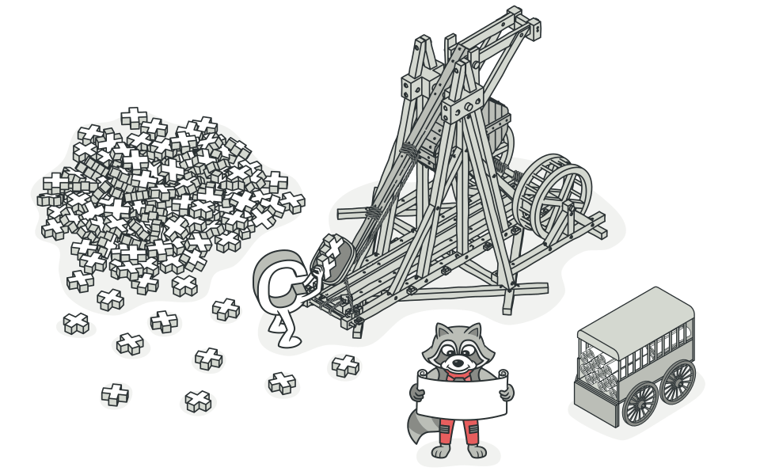
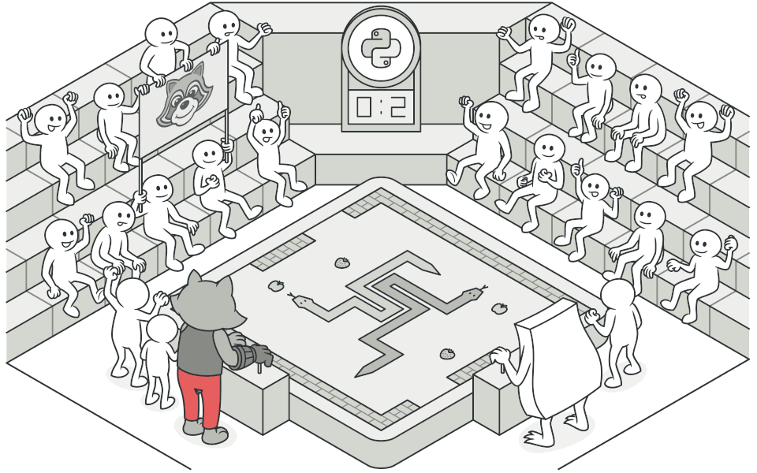
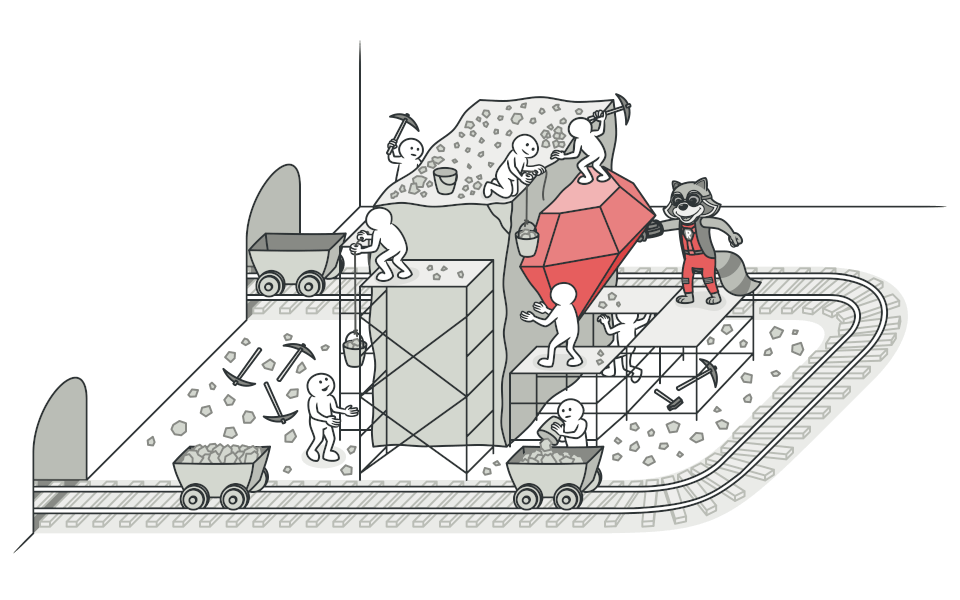
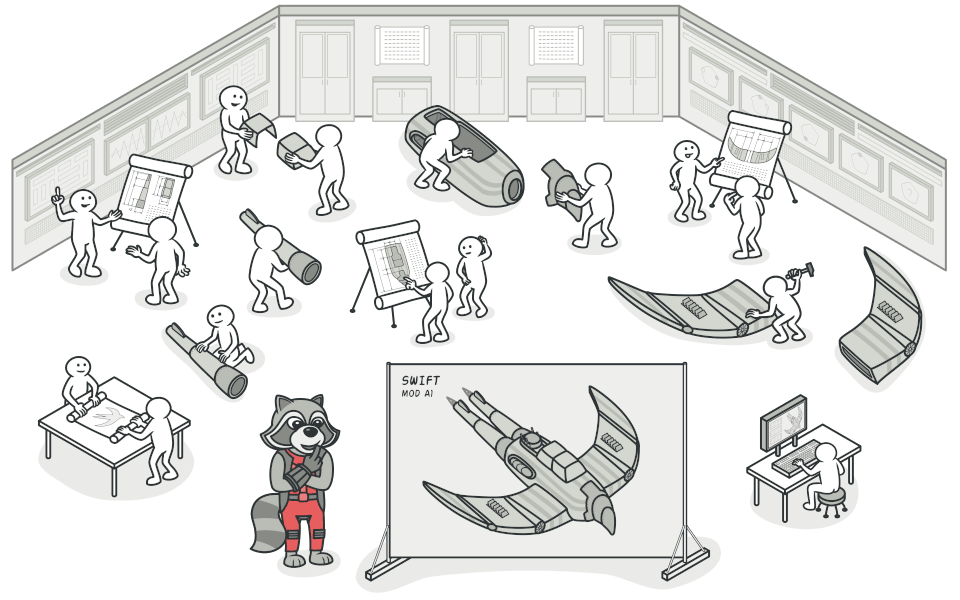

# DESIGN PATTERN LÀ GÌ ?

Design Pattern là một giải pháp tổng thể cho các vấn đề chung trong thiết kế phần mềm. Nó cũng tương tự các bản thiết kế cho xây dựng nhà cửa, chúng được dùng để giải quyết các vấn đề lặp đi lặp lại trong thiết kế của bạn.

Các design pattern không thể copy rồi paste như cách bạn làm với các function có sẵn hay thư viện, vì chúng không phải là những đoạn code cụ thể. Design pattern ở đây là những khái niệm tổng quát để giải quyết các vấn đề riêng biệt. Bạn có thể tìm hiểu các design pattern và triển khai chúng lên ứng dụng của bạn. Các pattern thường bị nhầm lẫn với thuật toán, vì chúng đều là những khái niệm mô tả giải pháp cho một vấn đề nào đó. 

Trong khi thuật toán là định nghĩa những hành động cụ thể để giải quyết vấn đề thì design pattern lại là một mô tả cao hơn cho các giải pháp. Code cho cùng một pattern có thể được triển khai trên hai ứng dụng khác nhau.

## Tài liệu design pattern bao gồm những gì ?

Hầu hết các tài liệu mô tả rất chính thống, để cho mọi người có thể tái sử dụng cho nhiều trường hợp. Dưới đây là các thành phần thường có trong các document mô tả pattern:

- **Invention**: mục đích pattern, mô tả ngắn gọn cả vấn đề và giải pháp.
- **Motivation**: giải thích thêm vấn đề và giải pháp mà mô hình khả thi.
- **Structure**: cấu trúc của các lớp cho thấy từng phần của pattern và chúng có liên quan như thế nào.
- **Example**: ví dụ bằng một trong những ngôn ngữ lập trình phổ biến giúp bạn dễ dàng nắm bắt ý tưởng đằng sau pattern.

# Tại sao nên học design pattern

Sự thật là các lập trình viên có thể xoay xở làm việc trong nhiều năm mà không cần biết đến bất kỳ pattern nào. Rất nhiều người làm như vậy. Tuy nhiên, ngay cả trong trường hợp đó, bạn có thể đang triển khai một số pattern mà không hề hay biết. Vậy tại sao bạn lại dành thời gian tìm hiểu chúng?

- Giúp sản phẩm của chúng ta linh hoạt, dễ dàng thay đổi và bảo trì hơn.
- Có một điều luôn xảy ra trong phát triển phần mềm, đó là sự thay đổi về yêu cầu. Lúc này hệ thống phình to, các tính năng mới được thêm vào trong khi performance cần được tối ưu hơn.
- Design pattern cung cấp những giải pháp đã được tối ưu hóa, đã được kiểm chứng để giải quyết các vấn đề trong software engineering. Các giải pháp ở dạng tổng quát, giúp tăng tốc độ phát triển phần mềm bằng cách đưa ra các mô hình test, mô hình phát triển đã qua kiểm nghiệm.
- Những khi bạn gặp bất kỳ khó khăn đối với những vấn đề đã được giải quyết rồi, design patterns là hướng đi giúp bạn giải quyết vấn đề thay vì tự tìm kiếm giải pháp tốn kém thời gian.
- Giúp cho các lập trình viên có thể hiểu code của người khác một cách nhanh chóng (có thể hiểu là các mối quan hệ giữa các module chẳng hạn). Mọi thành viên trong team có thể dễ dàng trao đổi với nhau để cùng xây dựng dự án mà không tốn nhiều thời gian.

# Khi nào nên sử dụng design pattern

Việc sử dụng các design pattern sẽ giúp chúng ta giảm được thời gian và công sức suy nghĩ ra các cách giải quyết cho những vấn đề đã có lời giải. Lợi ích của việc sử dụng các mô hình Design Pattern vào phần mềm đó chính là giúp chương trình chạy uyển chuyển hơn, dễ dàng quản lý tiến trình hoạt động, dễ nâng cấp bảo trì, …

Tuy nhiên điểm bất cập của design pattern là nó luôn là một lĩnh vực khá khó nhằn và hơi trừu tượng. Khi bạn viết code mới từ đầu, khá dễ dàng để nhận ra sự cần thiết phải có design pattern. Tuy nhiên, việc áp dụng design pattern cho code cũ thì khó khăn hơn.

Khi sử dụng những design pattern có sẵn thì chúng ta sẽ đối mặt với một vấn đề nữa là perfomance của product (code sẽ chạy chậm chẳng hạn). Cần phải chắc chắn là bạn đã hiểu toàn bộ mã nguồn làm việc như thế nào trước khi đụng vào nó. Việc này có thể là dễ dàng hoặc là đau đầu, phụ thuộc vào độ phức tạp của code.

Hiện nay chúng ta đang áp dụng rất nhiều design pattern vào công việc lập trình của mình. Nếu bạn thường tải và cài đặt các thư viện, packages hoặc module nào đó thì đó là lúc bạn thực thi một design pattern vào hệ thống.

Tất cả các framework cho ứng dụng web như Laravel, Codeigniter… đều có sử dụng những kiến trúc design pattern có sẵn và mỗi framework sẽ có những kiểu design pattern riêng.

# Phân loại design pattern

Hệ thống các design pattern được chia thành 3 nhóm: nhóm Creational, nhóm Structural và nhóm Behavioral.

- [**Creational Pattern**](./creational-pattern) cung cấp các cơ chế tạo đối tượng để tăng tính linh hoạt và tái sử dụng mã hiện có.
    + [**Factory Method**](./creational-pattern/factory-method)
    + [**Abstract Factory**](./creational-pattern/abstract-factory)
    + [**Builder**](./creational-pattern/builder)
    + [**Prototype**](./creational-pattern/prototype)
    + [**Singleton**](./creational-pattern/singleton)
- [**Structural Pattern**](./structural-pattern) giải thích cách tập hợp các đối tượng và lớp thành các cấu trúc lớn hơn, trong khi vẫn giữ cho cấu trúc linh hoạt và hiệu quả.
    + [**Adapter**](./structural-pattern/adapter)
    + [**Bridge**](./structural-pattern/bridge)
    + [**Composite**](./structural-pattern/composite)
    + [**Decorator**](./structural-pattern/decorator)
    + [**Facade**](./structural-pattern/facade)
    + [**Flyweight**](./structural-pattern/flyweight)
    + [**Proxy**](./structural-pattern/proxy)
- [**Behavioral Pattern**](./behavioral-pattern) quan tâm đến việc giao tiếp hiệu quả và phân công nhiệm vụ giữa các đối tượng.
    + [**Chain Of Responsibility**](./behavioral-pattern/chain-of-responsibility)
    + [**Command**](./behavioral-pattern/command)
    + [**Iterator**](./behavioral-pattern/iterator)
    + [**Mediator**](./behavioral-pattern/mediator)
    + [**Memento**](./behavioral-pattern/memento)
    + [**Observer**](./behavioral-pattern/observer)
    + [**State**](./behavioral-pattern/state)
    + [**Strategy**](./behavioral-pattern/strategy)
    + [**Template Method**](./behavioral-pattern/template-method)
    + [**Visitor**](./behavioral-pattern/visitor)

# Code Example

Code ví dụ của RefactoringGuru

## C#

## C++

## Go

## Java

## PHP

## Python

## Ruby

## Swift

## TypeScript

# Nguồn

[**refactoring**](https://refactoring.guru/design-patterns)