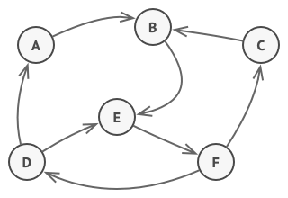
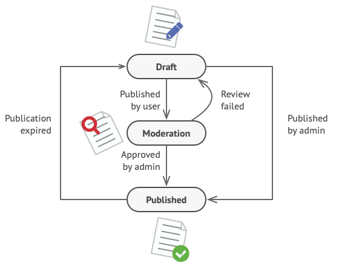

# State

## 📜 Mục đích

**State** là một design pattern dạng behavoiral giúp chỉnh sửa hành vi của một đối tượng khi trạng thái bên trong nó thay đổi. Nó xảy ra nếu như một đối tượng thay đổi lớp của nó.


## 😟 Vấn đề

Pattern State có mối quan hệ gần gũi với khái niệm [Máy trạng thái hữu hạn](https://vi.wikipedia.org/wiki/Máy_trạng_thái_hữu_hạn) (gọi tắt là máy trạng thái)



Ý tưởng chính là như thế này, tại bất kỳ thời điểm nào cũng có một hữu hạn trạng thái mà chương trình có thể có. Với từng trạng thái đơn nhất, chương trình sẽ có hành vi khác nhau và chương trình còn có thể chuyển từ trạng thái này sang trạng thái khác ngay lập tức. Tuy nhiên, điều này phụ thuộc vào trạng thái hiện tại, mà chương trình có thể chuyển hoặc không thể chuyển sang trạng thái khác. Quy luật chuyển đổi này gọi là *transitions*, nó hữu hãn và có thể định trước.

Bạn có thể áp dụng cách tiếp cận này lên các đối tượng. Ví dụ bạn có lớp `Document`. Một tài liệu có thể có 3 trạng thái: `Draft`(nháp), `Moderation` (chờ duyệt) và `Published` (đã công khai). Phương thức `public` của tài liệu làm việc với từng trạng thái sẽ có vài khác biết nhỏ:
- Ở `Draft`, nó chuyển tài liệu lên chờ duyệt.
- Ở `Moderation`, nó làm cho tài liệu công khai, nhưng chỉ khi người dùng hiện tại là admin.
- Ở `Publushed` nó không phải làm gì cả.



Máy trạng thái thường được triển khai với nhiều điều kiện hành động (`if` hoặc `switch`) để lựa chọn hành vi thích hợp dựa trên trạng thái hiện tại của đối tượng. Thông thường, "trạng thái" này chỉ là một tập hợp trường giá trí của đối tượng. Nếu bạn đã từng nghe về *Máy trạng thái hữu hạn* trước đây, thì bạn có lẽ đã triển khai nó ít nhất một lần. Ví dụ như đoạn code này bạn có thấy quen quen không?

```c
class Document is
    field state: string
    // ...
    method publish() is
        switch (state)
            "draft":
                state = "moderation"
                break
            "moderation":
                if (currentUser.role == 'admin')
                    state = "published"
                break
            "published":
                // Do nothing.
                break
    // ...
```

Điểm yếu lớn nhất của máy trạng thái nằm ở việc cái điều kiện tự để lộ chúng khi ta thêm quá nhiều trạng thái và các hành vi phụ thuộc trạng thái vào lớp `Document`. Phần lớn phương thức sẽ chứa các điều kiện quái dị, các điều kiện sẽ chọn hành vi phù hợp của phương thức theo trạng thái hiện tại. Điều này làm cho code trở nên kho bảo trì vì bất kỳ thay đổi logic nào đến transition sẽ đòi hỏi thay đổi điều kiện trạng thái ở tất cả phương thức.

Vấn đề có xu hướng trở nên lớn hơn khi dự án phát triển. Khá là khó khăn nhỏ để có thể dự đoán tất cả trạng thái và transition xảy ra ở giai đoạn thiết kế. Do đó, một máy trạng thái tinh gọn được xây dựng với một tập hợp điều kiện giới hạn có thể trở thành có thể phát triển thành một mớ hỗn độn theo thời gian. 

## 😊 Giải pháp

State đề xuất giải pháp là tạo một lớp mới cho tất cả trạng thái của một đối tượng và trích xuất tất cả hành vi dựa trên trạng thái cụ thể vào lớp đó.

Thay vì triển khai tất cả hành vi của nó, đối tượng gốc bây giờ gọi là *context* sẽ lưu tham chiếu đến một trong những đối tượng trạng thái, để biểu diện trạng thái hiện tại của nó và uỷ thác mọi công việc liên quan đến trạng thái cho đối tượng này.


Để chuyển context sang trạng thái khác, ta sẽ thay thế đối tượng trạng thái đang hoạt động với một đối tượng khác để có trạng thái mới. Điều này chỉ khả thi khi tất cả lớp trạng thái theo cùng một interface và context làm việc với các đối tượng đó thông qua interface này.

Cấu trúc này trông giống Strategy, nhưng có một điểm khác biệt. Ở State, các trạng thái cụ thể có thể biết về nhau và bắt đầu chuyển đổi từ trạng thái này sang trạng thái khác, trong khi các Stategy hầu như không bao giờ biết về nhau

## 🚗 Thế Giới Thực

Các button và switch trong điện thoại thông minh của bạn hoạt động khác nhau tùy thuộc vào trạng thái hiện tại của thiết bị:

- Khi điện thoại được mở khóa, việc nhấn các button dẫn đến việc thực hiện các chức năng khác nhau.
- Khi điện thoại bị khóa, nhấn bất kỳ button nào sẽ dẫn đến màn hình mở khóa.
- Khi điện thoại gần hết pin, nhấn bất kỳ button nào sẽ hiển thị màn hình sạc.

## 🏢 Cấu trúc


1. **Context** lưu trữ một tham chiếu đến một trong các đối tượng trạng thái cụ thể và uỷ thác cho nó tất cả công việc cụ thể của trạng thái. Context giao tiếp với đối tượng trạng thái thông qua interface state. Context bộc lộ setter đê ruyền vào nó một đối tượng trạng thái mới.
2. **State** là interface khai báo phương thức cụ thể của trạng thái. Phương thức này là có nghĩa với tất cả trạng thái cụ thể vì bạn không muốn trạng thái của bạn có một phương thức vô dụng không bao giờ dùng đến.
3. **Concrete State** cung cấp triển khai của nói cho phương thức cụ thể của trạng thái. Để tránh trùng lặp với code trên nhiều trạng thái, bạn nên cung cấp lớp trừu tượng trung gian cho đóng gói các hành vi dùng chung.

    Đối tượng trạng thái có thể lưu trữ một tham chiếu trở lại (backreference) đến đối tượng context. Thông qua tham chiếu này, trạng thái có thể tìm nạp thông tin cần thiết từ đối tượng context, cũng như bắt đầu chuyển trạng thái. 
4. Cả context và trạng thái cụ thể có thể thiết lập trạng thái tiếp theo của context và thực hiện chuyển đổi trạng thái thực tế bằng cách thay thế đối tượng trạng thái được liên kết với context.


