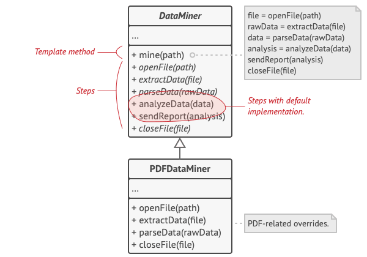

# Template Method

## 📜 Mục đích

**Template Method** là một design pattern dạng Behavioral giúp định nghĩa bộ khung của thuật toán ở lớp cha(superclass) nhưng để cho lớp con(subsclasses) ghi đè lên các bước cụ thể của thuật toán mà không làm thay đổi cấu trúc của nó.

## 😟 Vấn đề

Tưởng tượng bạn đang tạo một ứng dụng khai thác dữ liệu để phân tích tài liệu của công ty. Người dùng cung cấp cho tài liệu ứng dụng với các định dạng khác nhau (PDF, DOC, CSV) và cố trích xuất dữ liệu có nghĩa từ các tài liệu này ở một định dạng thồng nhất.

Phiên bản đầu tiên của ứng dụng chỉ làm việc với file DOC. Trong phiên bản tiếp theo nó hỗ trợ file CSV. Và một tháng sau, bạn "dạy" nó trích xuất dữ liệu từ file PDF.

Tại một số điểm, bạn nhận thấy rằng cả ba lớp có rất nhiều code giống nhau. Mặc dù code để xử lý các định dạng dữ liệu khác nhau hoàn toàn khác nhau ở tất cả các lớp, nhưng code để xử lý và phân tích dữ liệu gần như giống hệt nhau. Sẽ rất tuyệt vời nếu loại bỏ sự trùng lặp code nhưng giữ nguyên cấu trúc thuật toán phải không?

Có một vấn đề khác liên quan đến code client, sử dụng các lớp này. Nó có rất nhiều điều kiện để chọn một quá trình hành động thích hợp tùy thuộc vào lớp của đối tượng xử lý. Nếu cả ba lớp xử lý đều có một interface chung hoặc một lớp cơ sở, bạn có thể loại bỏ các điều kiện trong code client và sử dụng tính đa hình khi gọi các phương thức trên một đối tượng xử lý.

## 😊 Giải pháp

Template Method gợi ý rằng bạn nên chia nhỏ một thuật toán thành một chuỗi các bước, biến các bước này thành các phương thức và đặt một loạt lệnh gọi đến các phương thức này bên trong một phương thức template duy nhất. Các bước có thể là `abstract` (trừu tượng) hoặc có một số triển khai mặc định. Để sử dụng thuật toán, client phải cung cấp lớp con của chính nó, thực hiện tất cả các bước trừu tượng và ghi đè một số bước tùy chọn nếu cần (nhưng không phải phương thức template).

Hãy xem điều này sẽ diễn ra như thế nào trong ứng dụng khai thác dữ liệu. Ta có thể tạo một lớp cơ sở cho cả ba thuật toán phân tích cú pháp. Lớp này định nghĩa một phương thức template bao gồm một loạt các lệnh gọi đến các bước xử lý tài liệu khác nhau.

Lúc đầu, ta có thể khai báo tất cả các bước là `abstract`, buộc các lớp con cung cấp các triển khai riêng của chúng cho các phương thức này. Trong trường hợp của ta, các lớp con đã có tất cả các triển khai cần thiết, vì vậy điều duy nhất chúng ta có thể cần làm là điều chỉnh chữ ký của các phương thức để phù hợp với các phương thức của lớp cha.

Bây giờ, hãy xem ta có thể làm gì để loại bỏ code trùng lặp. Có vẻ như code để mở / đóng file  và trích xuất / phân tích cú pháp dữ liệu là khác nhau đối với các định dạng dữ liệu khác nhau, vì vậy bạn không cần phải đụng đến các phương pháp đó. Tuy nhiên, việc thực hiện các bước khác, chẳng hạn như phân tích dữ liệu raw và soạn báo cáo, rất giống nhau, vì vậy nó có thể được kéo lên lớp cơ sở, nơi các lớp con có thể chia sẻ mã đó.

Như bạn có thể thấy, ta có hai loại bước:

- các bước trừu tượng phải được thực hiện bởi mọi lớp con.
- các bước tùy chọn đã có một số triển khai mặc định, nhưng vẫn có thể bị ghi đè nếu cần.
- 
Có một loại bước khác, được gọi là hook. Hook là một bước tùy chọn với phần thân trống. Phương thức template sẽ hoạt động ngay cả khi hook không bị ghi đè. Thông thường, các hook được đặt trước và sau các bước quan trọng của thuật toán, cung cấp các lớp con với các điểm mở rộng bổ sung cho một thuật toán.

## 🚗 Thế Giới Thực

Phương pháp template có thể được sử dụng trong xây dựng hàng loạt ngôi nhà. Kế hoạch kiến trúc để xây dựng một ngôi nhà tiêu chuẩn có thể chứa một số điểm mở rộng cho phép chủ sở hữu tiềm năng điều chỉnh một số chi tiết của ngôi nhà kết quả.

Mỗi công đoạn xây dựng như đổ móng, đóng khung, xây tường, lắp đặt hệ thống ống nước, đi dây điện nước,… đều có thể thay đổi đôi chút để tạo cho ngôi nhà có một chút khác biệt so với những ngôi nhà khác.

## 🏢 Cấu trúc

1. **Abstract Class** là lớp trừu tượng khai báo các phương thức hoạt động như các bước của một thuật toán, cũng như phương thức template thực gọi các phương thức này theo một thứ tự cụ thể. Các bước có thể được khai báo là trừu tượng hoặc có một số triển khai mặc định.
2. **Concrete Classes** có thể ghi đè tất cả các bước, nhưng không thể ghi đè chính phương thức template.