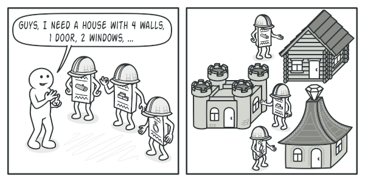

# 📜 Mục đích

**Builder** là design pattern thuộc nhóm creational, giúp bạn khởi tạo những đối tượng phức tạp theo từng bước. Pattern này cho phép bạn tạo ra các kiểu khác nhau và biểu diễn đối tượng bằng code khởi tạo giống nhau.

# 😟 Vấn đề

Hãy tưởng tượng một đối tượng phức tạp đòi hỏi nhiều công sức, phải tạo từng bước một với rất nhiều trường và các đối tượng lồng nhau. Các đoạn code khởi tạo như vậy sẽ nằm rất sâu trong hàm khởi tạo (constructor) khổng lồ với rất nhiều tham số. Hoặc tệ hơn là nó nằm rải rác trên các client code.

Ví dụ như làm thể nào để tạo một đối tượng `House`. Để xây dựng một ngôi nhà đơn giản, bạn cần tạo bốn bức tường, nền móng, cửa lớn, các cửa sổ phù hợp và mái nhà. Nhưng nếu sau này, bạn cần mở rộng nhà to hơn, sáng sủa hơn, với sân sau và những hệ thống tiên tiến như (hệ thống ống nước, hệ thống sưởi ấm, hệ thống dây điện)?

Giải pháp đơn giản nhất là mở rộng lớp cơ sở `House`, và tạo ra tập hợp lớp con để kết hợp tất cả các tham số. Nhưng điều này sẽ khiến bạn tạo ra một số lượng đáng kể lớp con, đồng thời với bất kỳ tham số mới nào, ví dụ như kiểu hiên nhà sẽ yêu cầu phát triển hệ phân cấp lớp nhiều hơn nữa.

Lúc này cách tiếp cận khác tránh việc tạo nhiều lớp con. Là bạn có thể tạo một hàm khởi tạo (constructor) lớn trong lớp cơ sở `House` với tất cả tham số cần thiết để điều khiển đối tượng `House`. Cách này tuy có thể giải quyết vấn đề lớp con nhưng lại rơi vào vấn đề khác.

*Nhược điểm của constructor nhiều tham số là không phải lúc nào cũng cần đến các tham số*

Trong phần lớn trường hợp, các tham số của bạn sẽ không được dùng đến (unused), điều này làm cho *hàm khởi tạo của bạn rất tệ*. Ví dụ chỉ một phần trong nhà bạn có hồ bơi, thì những tham số liên quan đến hồ bơi sẽ vô dụng khoảng 90%.

# 😊 Giải pháp

Ý tưởng của Builder pattern là bạn sẽ trích xuất các đoạn code khởi tạo đối tượng ra khởi lớp của nó và chuyển đến một đối tượng riêng biệt gọi là *builder*.

*Builder pattern giúp bạn khởi tạo đối tượng phức tạp theo từng bước.*

Pattern khởi tạo đối tượng theo trật tự từng bước một (vd như `buildWalls`, `buildDoor`,...).
Để tạo đối tượng, bạn thực thi một loạt các bước này trên đối tượng builder. Nhưng bạn không cần phải gọi đến tất các bước, mà chỉ cần gọi đến bước cần thiết để tạo cấu hình cụ thể của đối tượng.

Một vài bước khởi tạo yêu cầu triển khai khác nhau, khi bạn cần biểu diễn các biến thể của sản phầm. Ví dụ: tường của một cabin sẽ được xây bằng gỗ, còn tường của một lâu đài sẽ được xây bằng đá.

Trong trường hợp đấy, ta cần tạo ra nhiều lớp builder khác nhau, để triển khai các bước xây dựng giống nhau nhưng khác về cách thức. Sau đó bạn sử dụng builder trong quá trình khởi tạo để tạo ta các kiểu đối tượng khác nhau.

Ví dụ, cần xây dựng 3 ngôi nhà, cái thứ nhất được xây từ gỗ và kính, cái thứ hai được xây từ đá và sắt còn cái thứ ba được xây từ vàng và kim cương. Như vậy với lệnh gọi các bước thực hiện như nhau, ta sẽ có một ngôi nhà thông thường, một lâu đài và một cung điện. Tuy các nhiệm vụ giống nhau nhưng các xây dựng khác nhau với từng biến thể.

Song điều này chỉ hoạt động khi client code gọi các lệnh khởi tạo tương tác với builder thông qua inteface chung.

### Directory

Bạn có thể trích xuất một loạt lệnh gọi đến các bước của hàm khởi tạo, mà bạn sử dụng để xây dựng sản phẩm thành một lớp riêng biệt có tên là *director*.

Lớp directory xác định thứ tự thực thi của các bước xây dưng, trong khi builder cung cấp việc triển khai cho bước đó.

Các lớp directory là không bắt buộc. Bạn có thể gọi các bước xây dựng theo thứ tự cụ thể trực tiếp từ client code. Tuy nhiên, lớp directory là nơi lý tưởng để đặt các quy trình khởi tạo khác nhau mà bạn có thể sử dụng lại trong chương trình của mình.

Ngoài ra, lớp directory sẽ ẩn hoàn toàn chi tiết khởi tạo của sản phẩm với client code. Client code chỉ cần liên kết với directory, nhận hàm khởi tạo từ directory và kết quả từ builder.

# 🏢 Cấu trúc

