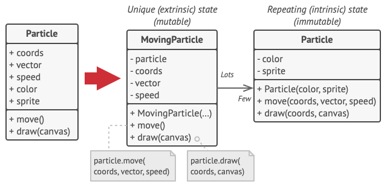

# Flyweight

## 📜 Mục đích

**Flyweight** là design pattern dạng structural giúp bạn chỉnh các đối tượng vừa với lượng RAM khả dụng bằng các chia sẻ trạng thái chung giữa các đối tượng thay vì giữ tất cả dữ liệu ở mỗi đối tượng.

## 😟 Vấn đề

Để tìm điều gì vui vẻ sau thời gian dài làm việc, bạn quyết định tạo một video game đơn giản: người chơi di chuyển vòng quanh bản đồ và bắn các đối thủ. Bạn chọn triển khai hệ thống hạt hệ thống phổ biến nhất dùng làm game effect trong Unity 3d)  và tạo các tính năng đặc biệt cho game. Số lượng lớn đạn, tên lửa và mảnh bom từ các vụ nổ sẽ văng khắp bản đồ và mang lại trải nghiệm ly kỳ cho người chơi.

Khi nó hoàn thành, bạn đã commit lần cuối, tạo game và gửi nó cho người bạn để kiểm tra thử. Mặc dù game chạy hoàn hảo trên máy bạn, nhưng người bạn của bạn lại không thể chơi trong thời gian dài. Vì nó bị crash sau vài phút trên máy anh ta. Sau nhiều giờ tìm hiểu debug log, bạn nhận ra game bị crash vì nó không đủ RAM. Bởi vì máy tính của anh ta không mạnh như máy bạn, nên các sự cố mới xảy ra.

Thực ra vấn đề này có liên quan đến hệ thống hạt. Với mỗi hạt, ví dụ như đạn, tên lửa hay mảnh bom sẽ được biểu diễn bởi một đối tượng riêng bao gồm nhiều dữ liệu. Cùng thời điểm đó, nếu người chơi tàn sát lẫn nhau trên màn hình, các hạt mới tạo ra không vừa với lượng RAM còn lại, nên chương trình bị crash. 

## 😊 Giải pháp

Khi kiểm tra kỹ hơn các lớp `Particle`, bạn sẽ nhận ra các trường màu sắc và sprite(ảnh biểu diễn hạt) tiêu thụ nhiều bộ nhớ hơn các trường khác. Điều tệ ở đây là hai trường này lưu trữ phần lớn dữ liệu giống hệt nhau ở tất cả hạt. Ví dụ, tất cả đạn đều có cùng màu sắc và sprite.

On closer inspection of the Particle class, you may notice that the color and sprite fields consume a lot more memory than other fields. What’s worse is that these two fields store almost identical data across all particles. For example, all bullets have the same color and sprite.

Mặt khác các trạng thái hạt như toạ độ, vector chuyển động và tốc độ là không trùng cho mỗi hạt. Đồng thời, giá trị các trường này sẽ thay đổi theo thời gian. Dữ liệu biểu diễn nó luôn thay đổi khi hạt tồn tại, trong khi màu sắc và sprite không đổi cho mỗi hạt.

Dữ liệu không đổi này của một đối tượng thường được gọi là *intrinsic state(trạng thái nội tại)*. Nó ở bên trong đối tượng; các đối tượng khác chỉ có thể đọc nó, không thể thay đổi nó. Phần còn lại trong trạng thái của đối tượng, thường bị thay đổi “từ bên ngoài” bởi các đối tượng khác, được gọi là *extrinsic state(trạng thái bên ngoài)*.

Ý tưởng của Flyweight là thay vì lưu trữ các trạng thái bên ngoài trong đối tượng. Bạn truyền trạng thái đó vào một phương thức cụ thể. Chỉ để trạng thái nội tại bên trong đối tượng, sử dụng lại nó cho các bối cảnh khác nhau. Do đó, bạn sẽ cần ít đối tượng hơn vì chúng chỉ khác nhau ở trạng thái nội tại, thứ có ít biến thể hơn nhiều so với trạng thái bên ngoài.

Một giải pháp gọn gàng hơn là tạo một lớp ngữ cảnh riêng để lưu trữ các trạng thái bên ngoài cùng với tham chiếu đến đối tượng flyweight. Các tiếp cận này chỉ yêu cầu một mảng duy nhất trong lớp container.

Đợi một chút! Chúng ta sẽ không cần phải có nhiều đối tượng ngữ cảnh này như chúng ta đã có ngay từ đầu sao? Về mặt kỹ thuật, có. Nhưng có điều, những vật thể này đã nhỏ hơn trước rất nhiều. Các trường sử dụng nhiều bộ nhớ nhất đã được chuyển đến chỉ một vài đối tượng trọng lượng nhẹ. Giờ đây, một nghìn đối tượng ngữ cảnh nhỏ có thể tái sử dụng một đối tượng hạng nặng duy nhất thay vì lưu trữ một nghìn bản sao dữ liệu của nó. 

